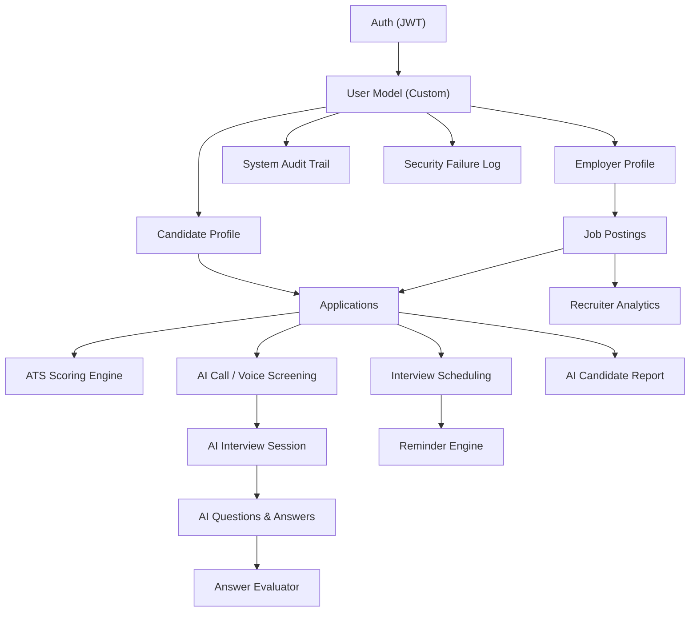

# Zecpath AI Job Portal — Codebase Analysis

## Overview

A **Django 6.0 + DRF** backend for an AI-powered recruitment platform. It supports **two user roles** (Candidate & Recruiter), job posting/application management, AI-driven resume parsing, ATS scoring, AI voice screening calls, interview scheduling, reminders, recruiter analytics, and audit/security monitoring.

**Tech Stack**: Python, Django 6.0.6, DRF, SimpleJWT, Celery + Redis, SQLite (dev), `django-filter`, `python-docx`, `pypdf`

---

## Architecture Summary

### Key Modules (13 utility engines in `core/utils/`)

| Module | Purpose |
|---|---|
| [`resume_parser.py`](file:///c:/Users/user/Desktop/zec/Zecpath-AI-Job-Portal-Automated-Hiring-Assistant/core/utils/resume_parser.py) | PDF/DOCX text extraction |
| [`resume_nlp.py`](file:///c:/Users/user/Desktop/zec/Zecpath-AI-Job-Portal-Automated-Hiring-Assistant/core/utils/resume_nlp.py) | NLP-based structured resume parsing |
| [`ats_engine.py`](file:///c:/Users/user/Desktop/zec/Zecpath-AI-Job-Portal-Automated-Hiring-Assistant/core/utils/ats_engine.py) | ATS suitability scoring |
| [`automation_engine.py`](file:///c:/Users/user/Desktop/zec/Zecpath-AI-Job-Portal-Automated-Hiring-Assistant/core/utils/automation_engine.py) | Auto-shortlist/reject thresholds |
| [`ai_call_engine.py`](file:///c:/Users/user/Desktop/zec/Zecpath-AI-Job-Portal-Automated-Hiring-Assistant/core/utils/ai_call_engine.py) | AI screening call orchestration |
| [`ai_voice_bridge.py`](file:///c:/Users/user/Desktop/zec/Zecpath-AI-Job-Portal-Automated-Hiring-Assistant/core/utils/ai_voice_bridge.py) | Voice TTS/STT bridge layer |
| [`answer_evaluator.py`](file:///c:/Users/user/Desktop/zec/Zecpath-AI-Job-Portal-Automated-Hiring-Assistant/core/utils/answer_evaluator.py) | AI answer scoring engine |
| [`interview_scheduler.py`](file:///c:/Users/user/Desktop/zec/Zecpath-AI-Job-Portal-Automated-Hiring-Assistant/core/utils/interview_scheduler.py) | Interview slot booking |
| [`reminder_engine.py`](file:///c:/Users/user/Desktop/zec/Zecpath-AI-Job-Portal-Automated-Hiring-Assistant/core/utils/reminder_engine.py) | Multi-channel reminders |
| [`report_generator.py`](file:///c:/Users/user/Desktop/zec/Zecpath-AI-Job-Portal-Automated-Hiring-Assistant/core/utils/report_generator.py) | AI candidate evaluation reports |
| [`recruiter_analytics.py`](file:///c:/Users/user/Desktop/zec/Zecpath-AI-Job-Portal-Automated-Hiring-Assistant/core/utils/recruiter_analytics.py) | Funnel & job performance metrics |
| [`notification_service.py`](file:///c:/Users/user/Desktop/zec/Zecpath-AI-Job-Portal-Automated-Hiring-Assistant/core/utils/notification_service.py) | Application status notifications |
| [`observability.py`](file:///c:/Users/user/Desktop/zec/Zecpath-AI-Job-Portal-Automated-Hiring-Assistant/core/utils/observability.py) | Audit trail & security failure logging |

---

## Strengths ✅

1. **Comprehensive feature set** — Covers the full hiring pipeline: auth → job posting → apply → ATS scoring → AI screening → interview scheduling → reminders → reports → analytics → audit logs
2. **Clean model design** — Good use of `ForeignKey`, `OneToOneField`, composite DB indexes, `unique_together` constraints, and `db_index` on hot columns
3. **Application status machine** — `ApplicationStatusUpdateSerializer` enforces valid transitions with an audit log trail
4. **Celery integration** — 5 async task queues + 2 periodic beat schedules for background processing
5. **Custom exception handler** — Unified error response format across all endpoints
6. **Signal-based profile creation** — Auto-creates `Candidate`/`Employer` profiles on user registration
7. **Soft deletes** — `is_deleted` flags on Candidate/Employer profiles instead of hard deletes
8. **File validation** — Size (5MB) and extension checks on resume uploads

---

## Bugs & Functional Issues 🐛

### Critical

| # | File | Issue |
|---|---|---|
| 1 | [`models.py:32-36`](file:///c:/Users/user/Desktop/zec/Zecpath-AI-Job-Portal-Automated-Hiring-Assistant/core/models.py#L32-L36) | **Duplicate `__str__`** on `AuditLog` — the second definition silently overrides the first. Dead code. |
| 2 | [`settings.py:17-23` vs `75-81`](file:///c:/Users/user/Desktop/zec/Zecpath-AI-Job-Portal-Automated-Hiring-Assistant/zecpath_backend/settings.py#L17-L23) | **`SIMPLE_JWT` defined twice** — the second (line 75) silently overrides the first, changing `ACCESS_TOKEN_LIFETIME` from 60 min to 1 day |
| 3 | [`settings.py:58-65` vs `67-73` vs `170-184`](file:///c:/Users/user/Desktop/zec/Zecpath-AI-Job-Portal-Automated-Hiring-Assistant/zecpath_backend/settings.py#L58-L73) | **`REST_FRAMEWORK` defined three times** — only the last (line 170) is active. The first two are dead code, and the `DEFAULT_PERMISSION_CLASSES` from line 58 is **silently lost** |
| 4 | [`settings.py:218-228` vs `230-241`](file:///c:/Users/user/Desktop/zec/Zecpath-AI-Job-Portal-Automated-Hiring-Assistant/zecpath_backend/settings.py#L218-L241) | **Voice/AI settings block duplicated verbatim** |
| 5 | [`views.py:866-876`](file:///c:/Users/user/Desktop/zec/Zecpath-AI-Job-Portal-Automated-Hiring-Assistant/core/views.py#L866-L876) | **`ApplicationCreateAPIView` redefined** — first at line 684 (inherits from `ApplyJobAPIView` with ATS scoring), then at line 866 (bare `CreateAPIView` without ATS scoring). The second **silently replaces** the first, breaking ATS score calculation on `POST /applications/create/` |
| 6 | [`views.py:1-94`](file:///c:/Users/user/Desktop/zec/Zecpath-AI-Job-Portal-Automated-Hiring-Assistant/core/views.py#L1-L94) | **Massive import duplication** — `APIView`, `Response`, `status`, `permissions`, `get_object_or_404`, `IsCandidate`, `parse_resume_file` are imported 4-5 times each |
| 7 | [`serializers.py:210-215` vs `232-237`](file:///c:/Users/user/Desktop/zec/Zecpath-AI-Job-Portal-Automated-Hiring-Assistant/core/serializers.py#L210-L237) | **`AuditLogSerializer` defined twice** — second silently overrides the first |
| 8 | [`tasks.py:282-283`](file:///c:/Users/user/Desktop/zec/Zecpath-AI-Job-Portal-Automated-Hiring-Assistant/core/tasks.py#L282-L283) | **`slot.date` and `slot.start_time`/`slot.end_time` mismatch** — `InterviewAvailabilitySlot` model has `start_time`/`end_time` (DateTimeField), but the email template references `slot.date` which doesn't exist → **will crash at runtime** |

### Medium

| # | File | Issue |
|---|---|---|
| 9 | [`views.py:747`](file:///c:/Users/user/Desktop/zec/Zecpath-AI-Job-Portal-Automated-Hiring-Assistant/core/views.py#L747) | **`CandidateRecommendedJobsAPIView`** reads `user.skills` directly, but `User` has no `skills` field — should be `user.candidate_profile.skills`. **Recommendations will never be personalized.** |
| 10 | [`permissions.py:27`](file:///c:/Users/user/Desktop/zec/Zecpath-AI-Job-Portal-Automated-Hiring-Assistant/core/permissions.py#L27) | **`IsEmployer` accepts `'employer'` role** but `User.role` choices only has `'candidate'` and `'recruiter'` — the `'employer'` check will never match |
| 11 | [`permissions.py:34`](file:///c:/Users/user/Desktop/zec/Zecpath-AI-Job-Portal-Automated-Hiring-Assistant/core/permissions.py#L34) | **`IsEmployerAndOwner.has_permission`** only checks for `'recruiter'` role but `IsEmployer` also accepts `'employer'` — inconsistent role gating |
| 12 | [`views.py:1`](file:///c:/Users/user/Desktop/zec/Zecpath-AI-Job-Portal-Automated-Hiring-Assistant/core/views.py#L1) | `from email.mime import application` — **unnecessary stdlib import**, likely a mistake |

---

## Security Concerns 🔒

| # | Severity | File | Issue |
|---|---|---|---|
| 1 | 🔴 Critical | [`settings.py:33`](file:///c:/Users/user/Desktop/zec/Zecpath-AI-Job-Portal-Automated-Hiring-Assistant/zecpath_backend/settings.py#L33) | **`SECRET_KEY` hardcoded in source** — should use environment variable |
| 2 | 🔴 Critical | [`settings.py:36`](file:///c:/Users/user/Desktop/zec/Zecpath-AI-Job-Portal-Automated-Hiring-Assistant/zecpath_backend/settings.py#L36) | **`DEBUG = True`** hardcoded — no env-based toggle |
| 3 | 🔴 Critical | [`settings.py:38`](file:///c:/Users/user/Desktop/zec/Zecpath-AI-Job-Portal-Automated-Hiring-Assistant/zecpath_backend/settings.py#L38) | **`ALLOWED_HOSTS = ['*']`** — accepts requests from any domain |
| 4 | 🟡 Medium | [`serializers.py:36-37`](file:///c:/Users/user/Desktop/zec/Zecpath-AI-Job-Portal-Automated-Hiring-Assistant/core/serializers.py#L36-L37) | **`UserSerializer` exposes `fields = '__all__'`** — leaks password hashes, `last_login`, internal flags |
| 5 | 🟡 Medium | [`exceptions.py:34`](file:///c:/Users/user/Desktop/zec/Zecpath-AI-Job-Portal-Automated-Hiring-Assistant/core/exceptions.py#L34) | **500 error handler exposes `str(exc)`** — raw exception messages leak to clients in production |
| 6 | 🟡 Medium | Views | Several endpoints (voice trigger, answer evaluation, scheduling) use only `IsAuthenticated` — **any authenticated user can trigger AI calls, book interviews, or evaluate answers for any application** |

---

## Code Quality & Maintainability Issues ⚠️

### Structural Problems

1. **Monolithic `views.py` (1,646 lines)** — All 40+ view classes in a single file. Should be split into modules like `views/auth.py`, `views/candidate.py`, `views/employer.py`, `views/admin.py`, `views/ai.py`, etc.

2. **`urls.py` fragmented pattern** — URL patterns are appended in 6 separate `urlpatterns +=` blocks with re-imports scattered throughout. ViewSets defined inline in `urls.py` (lines 124-149) should live in a proper viewsets module.

3. **Duplicated skill-matching logic** — `_fallback_score` / `_compute_profile_skills_score` appears identically in:
   - [`BatchAutoShortlistAPIView._fallback_score`](file:///c:/Users/user/Desktop/zec/Zecpath-AI-Job-Portal-Automated-Hiring-Assistant/core/views.py#L145-L153)
   - [`ApplyJobAPIView._compute_profile_skills_score`](file:///c:/Users/user/Desktop/zec/Zecpath-AI-Job-Portal-Automated-Hiring-Assistant/core/views.py#L673-L681)
   - [`async_compute_ats_score_task`](file:///c:/Users/user/Desktop/zec/Zecpath-AI-Job-Portal-Automated-Hiring-Assistant/core/tasks.py#L117-L129)
   
   Should be a shared utility function.

4. **`Employer` vs `Recruiter` role confusion** — The `User.role` choices define `'recruiter'`, but models/views reference both `'employer'` and `'recruiter'` interchangeably. `Job.employer` ForeignKey points to `User`, not the `Employer` model.

5. **No `__init__.py` in `utils/`** — Missing package initializer (may work due to implicit namespace packages but is not best practice).

### Missing Pieces

| Category | What's Missing |
|---|---|
| **No frontend** | `temp-frontend/` is empty |
| **No `.env` file** | Secrets & config hardcoded in settings |
| **No CORS config** | No `django-cors-headers` — frontend will be blocked |
| **No rate limiting** | No throttling on auth or public endpoints |
| **No API versioning** | All endpoints unversioned |
| **No Docker setup** | No `Dockerfile` or `docker-compose.yml` |
| **No CI/CD** | No GitHub Actions or pipeline config |
| **Incomplete tests** | [`tests.py`](file:///c:/Users/user/Desktop/zec/Zecpath-AI-Job-Portal-Automated-Hiring-Assistant/core/tests.py) covers only basic auth/CRUD; no tests for AI features, ATS engine, scheduling, or reminders |

---

## Summary Scorecard

| Dimension | Rating | Notes |
|---|---|---|
| **Feature Coverage** | ⭐⭐⭐⭐⭐ | Impressive breadth for an internship project |
| **Data Modeling** | ⭐⭐⭐⭐ | Well-structured with proper indexes & constraints |
| **Code Organization** | ⭐⭐ | Monolithic views, heavy duplication, fragmented URLs |
| **Security** | ⭐⭐ | Hardcoded secrets, permissive auth, data leaks |
| **Test Coverage** | ⭐⭐ | Basic tests only, critical paths untested |
| **Production Readiness** | ⭐ | Missing env config, Docker, CORS, rate limiting |

> [!TIP]
> **Top 3 quick wins:**
> 1. Remove all duplicate definitions (settings, views, serializers, imports)
> 2. Move `SECRET_KEY` / `DEBUG` to environment variables
> 3. Split `views.py` into a `views/` package with domain-specific modules
